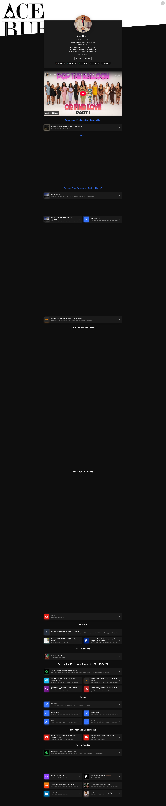

# ACE PLAYER

**A data-driven, self-hosted music player built from 12 years of Spotify listening data.**

145,933 streams. 5,155 hours. 180 tracks. 13 playlists. $0/month.



---

## Who Is Ace Burns?

Israel "Ace" Burns is an artist, engineer, and builder from New York. Cornell Tech alumnus (Law, Technology & Entrepreneurship). He raps, produces, codes, and builds businesses — all from the same machine.

Ace Burns is the #1 most-played artist in his own 12-year Spotify history (6,346 plays, 287 hours) — ahead of Drake (5,597 plays), Jhene Aiko (2,051 plays), 21 Savage (1,740 plays), and every other artist in his library. He doesn't just listen to music — he makes it, analyzes it, and built his own player to curate it.

Website: [aceburns.com](https://aceburns.com)
Business: [burnsconsulting.us](https://burnsconsulting.us)

---

## What Is ACE PLAYER?

ACE PLAYER is a subscription-free music player that uses 12 years of personal Spotify listening data to generate algorithmically curated playlists. It runs as a progressive web app and a native Android application with Android Auto integration.

Your streaming history is your intellectual property. The playlist algorithm isn't magic — it's your taste, quantified over a decade. You don't need Spotify's recommendation engine when you have 145,933 data points about what you actually like.

### Try It

[Launch ACE PLAYER](https://ace-taskmaster.duckdns.org/player)

[Read the White Paper](https://aceburns.com/aceplayer/)

---

## The Numbers

| Metric | Value |
|--------|-------|
| Total Streams | 145,933 |
| Hours Listened | 5,155 |
| Years of Data | 12 (2014-2026) |
| Curated Playlists | 13 |
| Tracks | 180 |
| Monthly Cost | $0.00 |

---

## Playlists

| Playlist | Tracks | Vibe |
|----------|--------|------|
| **Ace Burns** | 36 | Full discography — every track |
| **Drizzy** | 12 | Drake cuts |
| **Bars** | 12 | Kendrick, Eminem, J. Cole, Biggie |
| **Heat** | 12 | 21 Savage, Future, Travis, Pop Smoke |
| **Queens** | 12 | Cardi B, Nicki Minaj |
| **Afro** | 12 | Rema, Burna Boy, Asake, Ayra Starr |
| **Smooth** | 11 | Chris Brown, Jhene Aiko, Weeknd |
| **Soul** | 12 | Sade, Fela Kuti, Seal |
| **Vibes** | 12 | Coldplay, Radiohead, Pink Floyd, Bowie |
| **Santana** | 12 | Carlos Santana collection |
| **Meditate** | 12 | Ace Burns Koinda meditations + Enya |
| **Workout** | 12 | Travis Scott, Lil Uzi, Kanye |
| **Skating** | 12 | Kid Cudi, ScHoolboy Q, RHCP |

---

## Ace Burns Discography

Full catalog of original music by Ace Burns. All 36 tracks available in the player. See [discography/](discography/) for details.

| # | Track | Features |
|---|-------|----------|
| 1 | Black Berry Whine | — |
| 2 | Boss Fit | — |
| 3 | Land of the Kush | ft. YokeeGilla |
| 4 | Get in Touch (Pop Off) | — |
| 5 | Wacoinda | — |
| 6 | Wetin Dey Boot? | — |
| 7 | Undepress Me | — |
| 8 | Watch Your Step | — |
| 9 | Inclement Weather | — |
| 10 | Everyone's a Criminal | — |
| 11 | Life Is a Dreamo | ft. World Famous |
| 12 | Myriad Transformation State | — |
| 13 | New Trepound | — |
| 14 | F.B.I. | — |
| 15 | Suicide Beside Me | — |
| 16 | Witches Calling My Name | — |
| 17 | Anything You Know | — |
| 18 | The Story of Fuck 12 | — |
| 19 | Mercedes Slide | — |
| 20 | BATH COLD WATER | ft. P5yckonomixxx |
| 21 | Total & Complete Dickhead | — |
| 22 | Money Bag Joe | — |
| 23 | Little Nefertiti | — |
| 24 | Landlord | — |
| 25 | Christmas in Cresco | — |
| 26 | It's Not Too Late | — |
| 27 | Bird's Eye View | — |
| 28 | Change My Ways | — |
| 29 | Get out While You Can | — |
| 30 | America's Going Crazy | — |
| 31 | A2d2 | — |
| 32 | Night Riderz (Interlude) | — |
| 33 | 24k | — |
| 34 | Outsiding | — |
| 35 | No Love in BLM | — |
| 36 | Save 857 Riverside Drive | — |

### Koinda Meditation Series

| # | Track |
|---|-------|
| 1 | Koinda 1 Minute Guided Meditation |
| 2 | Koinda 3 Minute Guided Meditation |
| 3 | Koinda 5 Minute Guided Meditation |
| 4 | Koinda Vol 3 Meditations Intro |

---

## Top Artists by Play Count

| # | Artist | Plays | Hours |
|---|--------|-------|-------|
| 1 | **Ace Burns** | 6,346 | 287 |
| 2 | Drake | 5,597 | 308 |
| 3 | Jhene Aiko | 2,051 | 135 |
| 4 | 21 Savage | 1,740 | 98 |
| 5 | Chris Brown | 1,679 | 95 |
| 6 | Future | 1,542 | 79 |
| 7 | Rema | 1,348 | 66 |
| 8 | Kendrick Lamar | 1,111 | 68 |
| 9 | Kanye West | 981 | 54 |
| 10 | Kizz Daniel | 922 | 41 |

---

## Architecture

```
Web Layer:    Single HTML file (~25KB), YouTube IFrame API
Native Layer: Kotlin/Android, WebView + MediaLibraryService
Media Session: SimpleBasePlayer -> MediaSession -> Android Auto
Bridge:       JS <-> Kotlin via @JavascriptInterface
Hosting:      Nginx on GCP (HTTPS, DuckDNS)
Build:        Gradle 8.5, AGP 8.2.0, compileSdk 34
Data:         10 JSON files, 145,933 records, Python analysis
Cost:         $0.00/month (GCP free tier + YouTube IFrame API)
```

### How It Works

1. **Data Extraction** — Spotify GDPR export delivers complete listening history (every stream since 2014)
2. **Signal Processing** — Filter to real listens (>30 seconds), rank by weighted play count and total time
3. **Playlist Generation** — Cluster tracks by consumption patterns, select top tracks per category
4. **Video Resolution** — Each track resolved to a YouTube video ID via `yt-dlp` (180/182 = 99% hit rate)
5. **Playback** — YouTube IFrame API handles audio, MediaSession handles system integration

### Android Auto Pipeline

The native app wraps the web player in a WebView. A `PlaybackService` extends Media3's `MediaLibraryService`, exposing playlist metadata to Android Auto. A `StateProxyPlayer` mirrors the WebView's playback state to the system MediaSession — enabling lock screen controls, notification controls, and steering wheel buttons.

---

## Project Structure

```
ace-player/
├── app/                          # Android app (Kotlin)
│   └── src/main/
│       ├── java/.../service/     # PlaybackService (MediaLibraryService)
│       ├── java/.../player/      # StateProxyPlayer (SimpleBasePlayer)
│       ├── java/.../ui/          # PlayerHostActivity (WebView host)
│       └── res/                  # Layouts, themes, icons
├── assets/                       # Photos, logos, branding
│   ├── aceburns.png              # Artist photo
│   ├── burns_logo.png            # Logo
│   ├── hex_photo.png             # Hex portrait
│   └── business-card.png         # Business card
├── discography/                  # Music catalog & audio files
│   ├── CATALOG.md                # Full track listing with YouTube links
│   └── Christmas In Cresco (Mastered).wav
├── web/                          # Web player (single HTML file)
│   └── index.html                # ACE PLAYER PWA
├── LICENSE                       # Personal license
└── README.md                     # This file
```

---

## Build

### Web Player
No build step. Single HTML file. Deploy anywhere.

### Android App
```bash
export JAVA_HOME=$(/usr/libexec/java_home)
./gradlew assembleDebug
adb install app/build/outputs/apk/debug/app-debug.apk
```

Requires: Java 17, Android SDK 34, Gradle 8.5

---

## License

Copyright 2026 Israel "Ace" Burns. All rights reserved. See [LICENSE](LICENSE).

---

Built by [Israel "Ace" Burns](https://aceburns.com) | [Burns Consulting](https://burnsconsulting.us)
